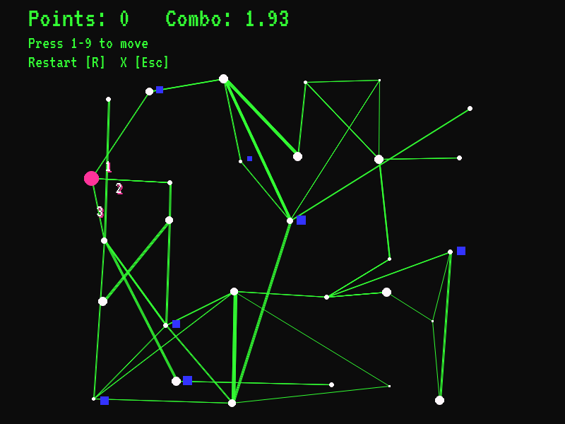

# Unicast Network Simulator

This is my entry for the Ludum Dare 53 game jam, to be completed in 72h as an entry for "The Jam".



## Links

[game on itch.io](https://richardbaltrusch.itch.io/unicast-network-simulator)
[ludum dare 53 entry](https://ldjam.com/events/ludum-dare/53/$361412)

## Run from source

Install dependencies:

```
python -m pip install pygame==2.1.3
```

Then run the main file:

```
cd src
python main.py
```

## Pygbag

To build the WebAssembly build of the game, install pygbag, then run:

```
python -m pygbag src
```

## Pyinstaller build

Install pygame and pyinstaller:

```
python -m pip install pygame==2.1.3
python -m pip install pyinstaller==5.10.1
```

Run pyinstaller (v) command:
```
pyinstaller -n unicast_network_sim src/main.py --collect-submodules src -y --add-binary=src/media;media --add-data=LICENSE;. --add-data=README.md;. --add-data=config.json;.
```

## Python

Built using Python 3.8+

## License

MIT License
